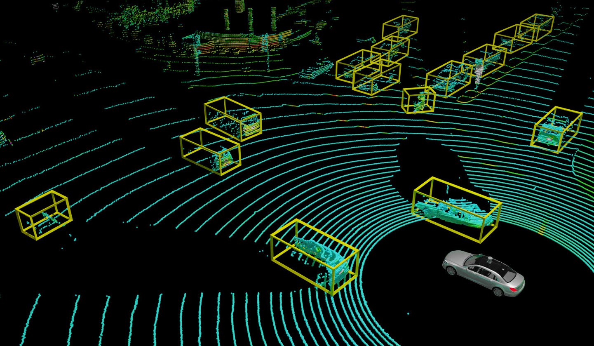
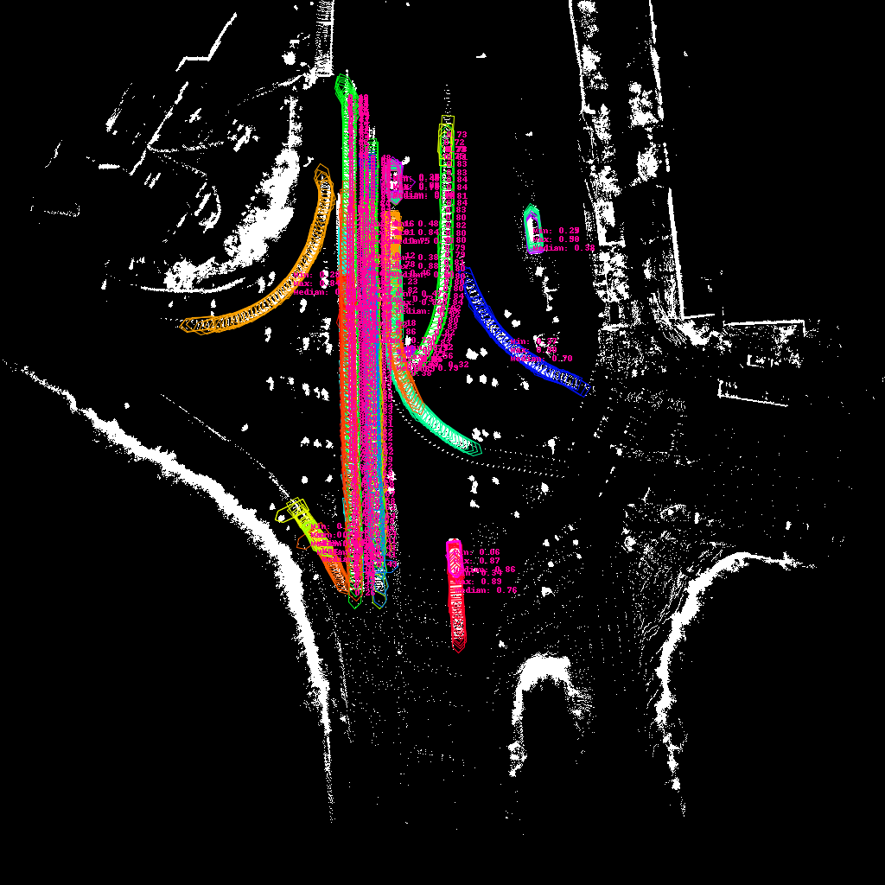
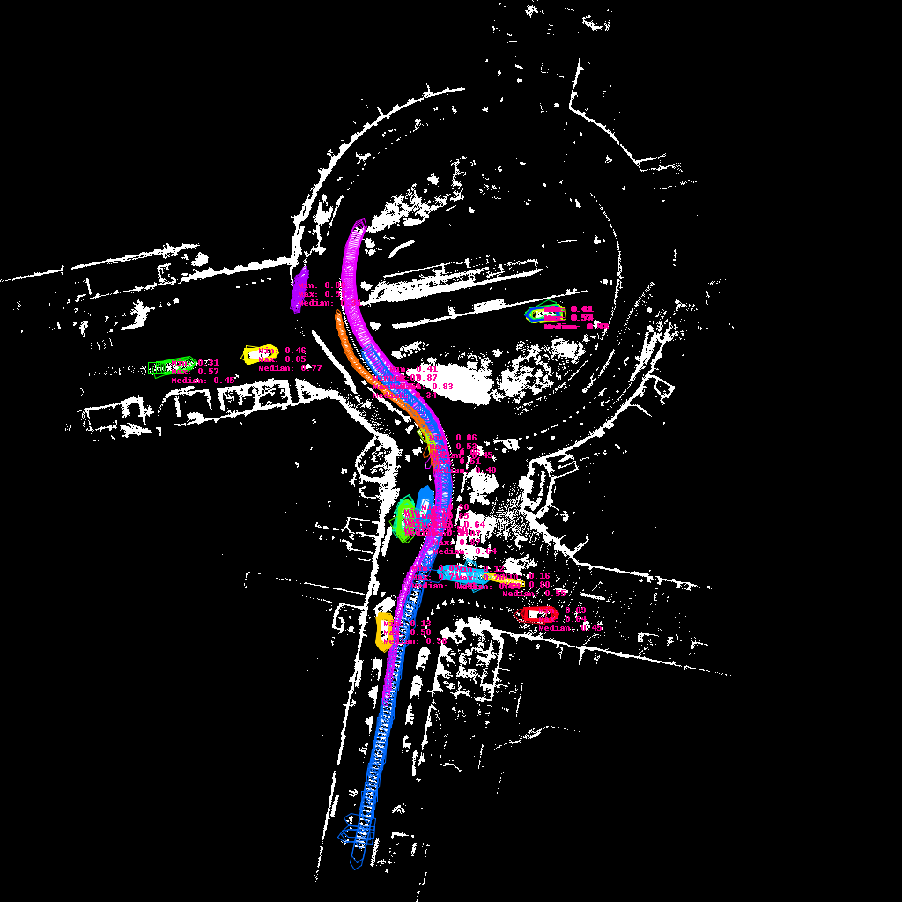
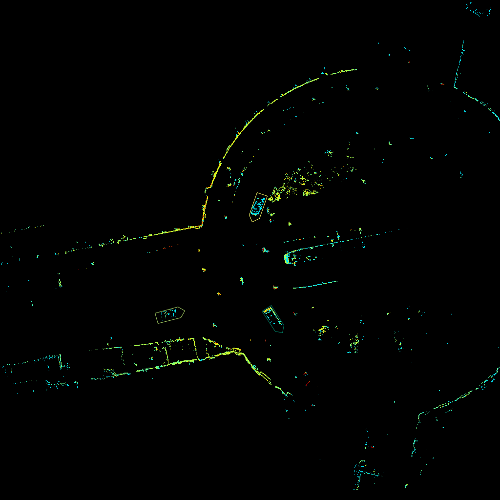

# Code for Paper: LISO: Lidar-only Self-Supervised 3D Object Detection
Stefan Baur, Frank Moosmann and Andreas Geiger

[[Paper]](https://arxiv.org/abs/2403.07071)

[[Project page & videos]](https://baurst.github.io/liso)



## Table of Contents:
1.  [Code Setup](#setup)
1.  [Data Setup](#data)
1.  [Train SLIM, export predicted Lidar Scene Flow](#slim)
1.  [Run LISO](#liso)
1.  [Miscellaneous Infos](#misc)
    1. [Other networks](#networks)
    1. [Ground Segmentation](#groundseg)
    1. [Visualizations](#vis)
    1. [Contributing](#contributing)
1. [Special Thanks](#thanks)
1. [Cite](#citation)

## Code Setup <a name="setup"></a>
In theory, all of the below steps can be run directly manually on your host system, since we use conda under the hood (cf [docker/Dockerfile.base](docker/Dockerfile.base)).
But we recommend using Docker, for automation, isolation from other projects and since some of our dependencies are quite picky wrt. specific versions, we need nvcc, and ease of deploying to some HPC cluster...

### Prerequisites
Please make sure you have a recent version of [docker compose](https://docs.docker.com/compose/install/linux/) installed on your machine.

### Configuring mounts
In `.devcontainer/docker-compose.yml` we mount `/mnt:/mnt` (mount directory `/mnt` from host to `/mnt` in docker). If your training data is stored somewhere else, add that mount there.

### TL;DR
```bash
git clone https://github.com/baurst/liso.git
cd liso/docker
./build_base_docker.bash
cd ..

# OPTION A
# ========
# Using vscode devcontainer extension (recommended)
# -> vscode: "Reopen in container"
# -> proceed to FINAL STEPS
# END OPTION A

# OPTION B
# ========
# You don't want to use vscode devcontainer extension
cd .devcontainer
./build_dev_docker.bash
UID_GID="$(id -u):$(id -g)" docker compose run liso_dev bash
# -> proceed to FINAL STEPS
# END OPTION B

# FINAL STEPS:
# (inside the container)
conda init && source ~/.bashrc && conda activate liso
./install_extra_packages.bash
```

### Detailed steps to install (with commentary)

```bash
git clone ...
cd liso/docker
./build_base_docker.bash
```
This will build the docker image `liso_base:latest` with all basic dependencies installed.

Then open the respository with vscode, and using extension [Dev Containers](https://marketplace.visualstudio.com/items?itemName=ms-vscode-remote.remote-containers), select "Reopen in container" when prompted.
This will automatically build the image `liso_dev:latest`, which will allow you to develop and debug inside the container with all dependencies installed.

(**Alternatively** if you don't want to use vcsode/Dev Containers, do `cd .devcontainer` and run `UID_GID="$(id -u):$(id -g)" docker compose run liso_dev bash` to launch and attach into the container.)

Once you are **inside** the development container (corresponding to image `liso_dev:latest`), run
```bash
# The default conda environment should be automatically activated in the docker, if not, do `conda activate liso` first.
./install_extra_packages.bash
```
to install the remaining required packages (iou3d_nms, mmdet3d, config_helper).

## Data Setup <a name="data"></a>
All of the following steps assume that you have built the docker container and are attached to it.
**Note:** If you happen to use vscode, we have added debug targets for all of the data preprocessing steps [launch.json](.vscode/launch.json) - so you can directly run all of them interactively in the vscode debugger.

### KITTI
Pre-processed samples will be saved to `KITTI_TARGET_DIR` (replace with your preferred dir).
Note, you only need one single `KITTI_TARGET_DIR`, suffixes "kitti_tracking", "kitti_object", "kitti_raw" will be added automatically.
Using the KITTI dataset requires 3 steps: We need KITTI Raw (1.) for training. KITTI Tracking (2.) is required for evaluation of SLIM (lidar scene flow). KITTI Object (3.) is required to evaluate LISO.

#### 1. KITTI Raw
Download Kitti Raw to `KITTI_RAW_ROOT` [Kitti Raw](https://www.cvlibs.net/datasets/kitti/raw_data.php)
You don't need to download camera data.
```bash
cd liso/datasets/kitti
python create_kitti_raw.py --kitti_raw_root KITTI_RAW_ROOT --target_dir KITTI_TARGET_DIR
```

#### 2. KITTI Tracking
Download Kitti Tracking to `KITTI_TRACKING_ROOT` [Kitti Tracking](https://www.cvlibs.net/datasets/kitti/eval_tracking.php).
You don't need to download camera data.

```bash
cd liso/datasets/kitti
python create_kitti_tracking.py --kitti_tracking_root KITTI_TRACKING_ROOT --target_dir KITTI_TARGET_DIR
```

#### 3. KITTI Object
Download Kitti Object to `KITTI_OBJECT_ROOT` [Kitti Object](https://www.cvlibs.net/datasets/kitti/eval_object.php?obj_benchmark=3d).
You don't need to download camera data.

```bash
cd liso/datasets/kitti
python create_kitti_tracking.py --kitti_raw_root KITTI_RAW_ROOT --kitti_object_root KITTI_OBJECT_ROOT --target_dir KITTI_TARGET_DIR
```

Finally, in `liso/config/liso_config.yml` set `data.kitti.local` to your `KITIT_TARGET_DIR`

### nuScenes
Download [nuScenes](https://www.nuscenes.org/download) to `NUSC_ROOT`.
Pre-processed samples will be saved to `NUSC_TARGET_DIR`.

```bash
cd liso/datasets/nuscenes
python create.py --nusc_root NUSC_ROOT --target_dir NUSC_TARGET_DIR
```

Finally, in `liso/config/liso_config.yml` set `data.nuscenes.pure_datast_root.local` to `NUSC_ROOT` and `data.nuscenes.local` to `NUSC_TARGET_DIR`.

### AV2
Download the [Argoverse sensor dataset](https://www.argoverse.org/av2.html#download-link) to `AV2_ROOT`.
Because of the special dependencies of AV2 devkit, you need to `conda activate av2` before executing it.

```bash
conda deactivate  # disable liso conda env if necessary
conda activate av2
cd liso/datasets/argoverse2
python create.py --av2_root AV2_ROOT --target_dir AV2_TARGET_DIR
```
If you want to run on multiple cores, you can use arguments `--world_size` (=number of workers you want to use) and `--worker_id` (=unique id for each worker), to speed up the export:
```bash
python create.py --av2_root AV2_ROOT --target_dir AV2_TARGET_DIR --world_size 2 --worker_id 0 &
python create.py --av2_root AV2_ROOT --target_dir AV2_TARGET_DIR --world_size 2 --worker_id 1
```
Finally, in `liso/config/liso_config.yml` set `data.av2.local` to `AV2_TARGET_DIR`
After this, you can continue to work in conda env `liso` with the data.

### WOD
We use the preprocessing pipeline of OpenPCDet (since we had this data lying around from a previous project and the tensorflow dependency is annoying).

```bash
git clone https://github.com/open-mmlab/OpenPCDet
cd OpenPCDet
git checkout v0.5.0
```
and follow the steps in [GETTING_STARTED.md](https://github.com/open-mmlab/OpenPCDet/blob/v0.5.0/docs/GETTING_STARTED.md#waymo-open-dataset) for the Waymo Dataset, to write the preprocessed data into `WOD_TARGET_DIR`.
Then, in `liso/config/liso.yml` set the attributes `data.paths.waymo.ground_segmentation.local` and `data.paths.waymo.poses_kiss_icp_kitti_lidar.local`.

Then, generate the KISS-ICP odometry and groundsegmentation masks by running:
```bash
cd liso/datasets
python waymo_torch_dataset.py
```

Finally, in `liso/config/liso_config.yml` set `data.paths.waymo.local` to `WOD_TARGET_DIR`

## Train SLIM, export predicted Lidar Scene Flow <a name="slim"></a>
You can use either configs `slim_kitti`, `slim_nuscenes`, `slim_waymo` or `slim_av2`.
Replace `YOUR_DESIRED_LOG_DIR_HERE` to point to your desired directory for tensorboard logging (it is best if you are reasonably specific, eg. `/mnt/my_data/slim_trainings/first_try_kitti`).

```bash
# Train SLIM (takes around one day on one V100)
python3 liso/slim/cli.py --summary-dir YOUR_DESIRED_LOG_DIR_HERE -c slim_simple_knn_training slim_kitti use_lidar_intensity slim_RAFT batch_size_one slim_highest_resolution
```

After training, to export the predicted lidar scene flow, replace `PATH_TO_CHECKPOINT_PTH` with your desired checkpoint:

```bash
# Export Scene Flow for a checkpoint
python3 liso/slim/cli.py --inference-only --summary-dir YOUR_DESIRED_LOG_DIR_HERE --load_checkpoint PATH_TO_CHECKPOINT_PTH
```

Enter the directory with the exported flow .npzs `YOUR_DESIRED_LOG_DIR_HERE/..../preds` into `liso/config/liso_config.yml` at `data.paths.{av2|kitti|...}.slim_flow.slim_bev_120m.local=YOUR_DESIRED_LOG_DIR_HERE/..../preds`.

## Run LISO <a name="liso"></a>
The entrypoint for the experiments is `liso/kabsch/liso_cli.py`.
Note: If you pass `--fast-test` this will run a mini-training, testing all code paths with very few iterations (tracking, validation, ...).
If this succeeds, you should be able to expect the full experiment to run without error.

### Configuration Management
We use `liso/config/liso_config.yml` to configure our experiments. This config file has multiple top-level entries. The top level entry **default** is loaded for every experiment as base.

> [!TIP]
> The default configuration without any changes will __not__ work.

Changes to the configuration can be applied in two ways:
1. On top of the default config, other top level configs from within this file can be applied and will then replace the defaults. Each config can have its own `meta_cfgs`, which can reference other configs that will then be applied recursively. To apply a config change to the default, use the `-c` flag. For example: `python3 liso/kabsch/liso_cli.py -c waymo bev_100m_512 centerpoint batch_size_four liso gt_odom`. This will first apply config `waymo`, then `bev_100m_512`, etc. - see [liso/config/liso_config.yml](liso/config/liso_config.yml).
2. Alternatively, if you only want to change a single parameter directly `-kv` takes a list of strings: `-kv optimization rounds confidence_threshold_mined_boxes 0.3` will set `cfg.optimization.rounds.confidence_threshold_mined_boxes = 0.3`. The list of strings specify the config value location in the hierarchy of the config. If you want to change multiple parameters, just use multiple instances of `-kv` like so: `-kv SLIM optimizer adam -kv nms_iou_threshold 0.3`.

### Run
To run for example LISO with network Centerpoint KITTI on SLIM flow, you have to run:

```bash
python3 liso/kabsch/liso_cli.py --summary-dir YOUR_DESIRED_LOG_DIR_HERE -c kitti bev_100m_512 centerpoint batch_size_four liso
```

You can also run it using ground truth flow (possible only on Waymo, nuscenes, AV2) and maybe even ground truth odometry, like so:

```bash
python3 liso/kabsch/liso_cli.py --summary-dir YOUR_DESIRED_LOG_DIR_HERE -c waymo bev_100m_512 centerpoint batch_size_four liso gt_odom -kv data flow_source gt
```

## Miscellaneous Infos <a name="misc"></a>

### Other networks <a name="networks"></a>
This repo also fully supports pointpillars, and experimentally pointrcnn.

```bash
python3 liso/kabsch/liso_cli.py --summary-dir YOUR_DESIRED_LOG_DIR_HERE -c kitti bev_100m_512 pointpillars batch_size_two liso
```

### Ground Segmentation <a name="groundseg"></a>
If you just need some simple ground segmentation "that just works" without ROS or other complicated dependencies, I reimplemented [JCP Ground Segmentation](https://github.com/wangx1996/Fast-Ground-Segmentation-Based-on-JPC) [here](liso/jcp/jcp.py).
Depedencies are minimal: OpenCV, numba, numpy. There are **no** dependencies into liso, so you can just yank it out of this repo and use it elsewhere.

### Visualizations <a name="vis"></a>
This repo also contains a lot of visualization utils which I found helpful during development.
Open a tensorboard in `YOUR_DESIRED_LOG_DIR_HERE` and you should see image summaries like the following:

Tracks with confidence scores       | corresponding gif
:-------------------------:|:-------------------------:
 | 
 | 

... and some others.
These really don't slow down the training much, but are very helpful to analyse the model and to identify problems.

### Contributing <a name="contributing"></a>
If you want to contribute, please install first pre-commit hooks (black formatter, flake8, isort).

```bash
pip install pre-commit
pre-commit install
```

These will run every time you commit something. All contributions are welcome!

## Special Thanks <a name="thanks"></a>
... goes to the following projects/authors who have published their code, which has made this work possible:
* [KISS-ICP](https://github.com/PRBonn/kiss-icp) for building an easy-to-use lidar odometry solution that just works
* [JCP Ground Segmentation](https://github.com/wangx1996/Fast-Ground-Segmentation-Based-on-JPC) for their excellent ground segmentation that was easily translatable to pure [python](liso/jcp/jcp.py)
* [mmdetection3d](https://github.com/open-mmlab/mmdetection3d) - needs no further explanation
* [OpenPCDet](https://github.com/open-mmlab/OpenPCDet), esp. for their GPU-accelerated [nms/iou](iou3d_nms) computation

This list is incomplete, I apologize to anyone I forgot.

## Cite <a name="citation"></a>
```latex
@inproceedings{Baur2024ECCV,
  author = {Stefan Baur and Frank Moosmann and Andreas Geiger},
  title = {LISO: Lidar-only Self-Supervised 3D Object Detection},
  booktitle = {European Conference on Computer Vision (ECCV)},
  year = {2024}
}
```
